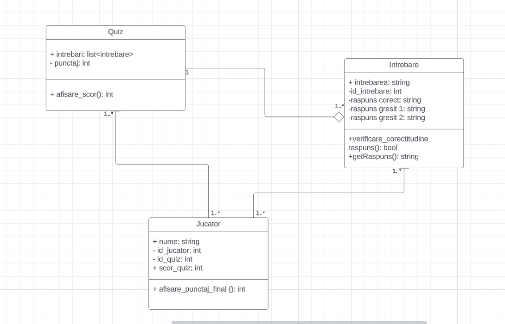

# Titlu proiect: Quiz
### Student: Iov Eric-Robert

## Descriere
Proiectul constă în dezvoltarea unei aplicații interactive de tip quiz de cultură generală, având ca scop atât testarea cât și îmbogățirea cunoștințelor generale ale utilizatorilor. Această aplicație va oferi o experiență plăcută și educațională, permițând utilizatorilor să se distreze în timp ce învață lucruri noi. Întrebările din quiz vor acoperi o gamă variată de domenii, inclusiv istorie, știință, artă, geografie, muzică și altele.

## Obiective

* Testarea cunoștințelor utilizatorilor.
* Dezvoltarea unui sistem de gestionare a întrebărilor și răspunsurilor.
* Implementarea unui sistem de scor și feedback pentru utilizatori.
* Crearea unei interfețe ușor de utilizat.

## Arhitectura

În această diagramă am reprezentat fiecare clasa și relațiile dintre ele. 

Quiz și Întrebare:
O clasă Quiz poate să aibă o relație de agregare cu clasa Întrebare. Asta înseamnă că întrebările sunt o parte din Quiz.

Jucator și Quiz:
Un Jucator poate să participe la un quiz. Deci, există o relație de asociere între Jucator și Quiz.

Jucator și Întrebare:
Un Jucator poate să răspundă la mai multe întrebări în cadrul unui quiz. Deci, există o relație de asociere între Jucator și Întrebare în contextul jocului.

## Functionalitati/Exemple utilizare
* Posibilitatea de a răspunde la întrebări
* Afișarea răspunsurilor corecte
* Afișarea punctajului total
* Afișarea clasamentului
* Afișarea timpului total pentru a rezolva quiz-ul

 Utilizatorul începe quiz-ul și răspunde la o serie de întrebări, urmând să îi fie afișat punctajul după ce răspunde la ultima întrebare. Apoi, utilizatorul va fi clasat pe o anumită poziție în clasamentul general.

### Resurse
[YouTube - Example Quiz Application](https://www.youtube.com/watch?v=UI6lqHOVHic)

-------------------------------------------------------------------------------------------------------------------------------------------------------------------------------------------------------------------------------

# Project Title: Quiz
### Student: Iov Eric-Robert

## Description
The project involves developing an interactive general knowledge quiz application, aiming to both test and enrich users' general knowledge. This application will provide a pleasant and educational experience, allowing users to have fun while learning new things. The quiz questions will cover a wide range of topics, including history, science, art, geography, music, and more.

## Objectives

* Testing users' knowledge.
* Developing a system for managing questions and answers.
* Implementing a scoring system and feedback for users.
* Creating a user-friendly interface.

## Architecture

In this diagram, each class and the relationships between them are represented.

Quiz and Question:
A Quiz class can have an aggregation relationship with the Question class. This means that questions are a part of the Quiz.

Player and Quiz:
A Player can participate in a quiz. So, there is an association relationship between Player and Quiz.

Player and Question:
A Player can answer multiple questions within a quiz. So, there is an association relationship between Player and Question in the context of the game.

## Features/Usage Examples

* Ability to answer questions.
* Displaying correct answers.
* Displaying the total score.
* Displaying the leaderboard.
* Displaying the total time taken to complete the quiz.

The user starts the quiz and answers a series of questions, and their score is displayed after answering the last question. Then, the user will be ranked on a certain position in the overall leaderboard.

### Resources
[YouTube - Example Quiz Application](https://www.youtube.com/watch?v=UI6lqHOVHic)

